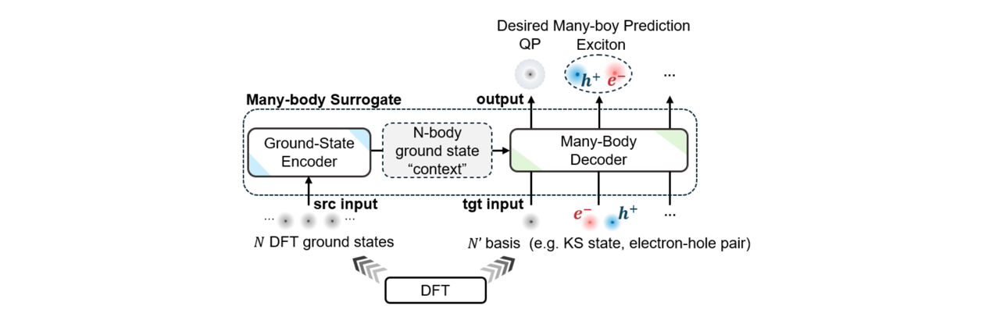

# Deep-GWBSE

DeepGWBSE is an end-to-end **first-principles + deep learning pipeline** designed for DFT-GW-BSE many-body effects calculations.

Author: Bowen Hou (bowen.hou@yale.edu)

Contributors: Xian Xu, Chengyan Zhang, Jinyuan Wu

## Outline
- [Deep-GWBSE](#deep-gwbse)
  - [Features](#features)
  - [Installation](#installation)
  - [Quick Start](#quick-start)
  - [Repo Structure](#repo-structure)
  - [Documentation](#documentation)
  - [License](#license)
  - [Acknowledgements](#acknowledgements)


## Features
This package provides deep learning models for DFT-GW-BSE calculations from crystal structures, including the following:
- Fully-automatic DFT-GW+BSE workflow with fast convergence strategy:
  - Parabands + Pseudobands ([AR Altman, et al., PRL, 2024](https://journals.aps.org/prl/abstract/10.1103/PhysRevLett.132.086401))
  - NNS ([FH da Jornada et al., PRB, 2017](https://journals.aps.org/prb/abstract/10.1103/PhysRevB.95.035109))
- VAE+MBFormer: transformer-based model for many-body GW-BSE    
    <p align="center">
      
    </p>

## Installation

### Prerequisites: First-principles software packages
- [Quantum ESPRESSO](https://www.quantum-espresso.org/) version 6.8
- [BerkeleyGW](https://berkeleygw.org/documentation/tutorial/) version 3

### Deep-GWBSE Package Dependency/Installation

#### Option 1: Using `uv` 

```bash
cd DeepGWBSE
[Option] curl -LsSf https://astral.sh/uv/install.sh | sh  # if you don't have uv installed
uv sync
source .venv/bin/activate
```
#### Option 2: Using `pip` (Package installation)
```bash
cd DeepGWBSE
conda create -n deep-gwbse python=3.9 -y
conda activate deep-gwbse
pip install -e .
```

## Quick Start

### 1. General Pipeline:

```
xxx.cif(s) --(flows.py)--> flows/ --(mbformer_data_tools)--> dataset.h5 --(vae, gw, bse trainer)--> model
```

### 2. DFT-GW-BSE Workflow Scripts


Create DFT-GW-BSE workflows for multiple materials from a directory:

```bash
# Make sure BerkeleyGW/bin/kgrid.x is in your $PATH (we will integrate it into the package in the future)
python flows.py [ -c ./config/fpconfig.json]
```

[Optional]: Create augmentation workflows by shifting k-grid (Skip this step if you haven't finished BSE calculations in `./flows`):

```bash
python flows-augmentation.py -c ./config/augconfig.json
```

We also provide a versatile script to control, collect, and monitor the DFT-GW-BSE calculations (see help by `-h`).

```bash
python collect_tool.py -h
```

**Note 1**: Even if you are not interested in deepl learning part, the workflow scripts are still very useful to quickly setup GW-BSE calculations to save labor effort.

**Note 2**: When doing your own DFT-GW-BSE calculations, modify the configuration files (`DeepGWBSE/config/`) to customize your calculations.

### 3. MBFormer Training Scripts

The `mbformer_gwbse.py` script demonstrates how to use MBFormer models for GW-BSE training and inference. It consists of **four main parts**:

- **Data Preprocessing** – Prepare datasets from raw GW-BSE calculations.  
- **VAE Training** – Train an Equivariant Variational Autoencoder (E2-VAE) to embed Kohn-Sham wavefunctions.  
- **GW Training** – Train a transformer model for GW (G0W0) energy predictions.  
- **BSE Training** – Train transformer models for BSE predictions, including eigenvalues, eigenvectors, and dipole moments.  

Simply run the script to start the pipeline:

```bash
python mbformer_gwbse.py
```

it will generate the trained models, log and visualizations in `results/` directory.

---

#### Part 1: Data Preprocessing

Preprocess raw GW-BSE calculation data to generate training datasets.  

This step creates **three HDF5 files**:

| Dataset | Purpose |
|---------|---------|
| `results/dataset/dataset_WFN.h5` | For training the VAE |
| `results/dataset/dataset_GW.h5` | For training the GW-MBFormer |
| `results/dataset/dataset_BSE.h5` | For training the BSE-MBFormer |

**Prerequisites:** Completed DFT-GW-BSE calculations should exist in `./examples/flows`.

---

#### Part 2: VAE Training

Train an **Equivariant Variational Autoencoder (E2-VAE)** to embed Kohn-Sham wavefunctions.  

**Requirements:**

- WFN dataset: `./results/dataset/dataset_WFN.h5`  

**Output:**

- Trained model saved as: `./results/vae_e2_wfn.save`

---

#### Part 3: GW Training

Train a transformer model for **GW (G0W0) energy predictions**.  

**Requirements:**

- Trained VAE model: `./results/vae_e2_wfn.save`  
- GW dataset: `./results/dataset/dataset_GW.h5`  

---

#### Part 4: BSE Training

Train transformer models for **BSE predictions**, including eigenvalues, eigenvectors, and dipole moments.  

**Requirements:**

- Trained VAE model: `./results/vae_e2_wfn.save`  
- BSE dataset: `./results/dataset/dataset_BSE.h5`  


## Repo Structure

```
Deep-GWBSE/
├── deep_gwbse/          # Main package
│   ├── __init__.py
│   ├── README.md        # Documentation for developers
│   ├── flow.py          # Single material workflow class
│   ├── from_bgwpy/      # BGWpy integration
│   ├── from_model/      # ML models and trainers
│   ├── from_oncvpsp/    # OnCVPSP pseudopotentials
│   ├── from_c2db/        # QE integration
│   └── fptask.py
├── flows.py             # Root-level script for multiple materials
├── flows-augmentation.py  # Root-level augmentation script
├── mbformer_gwbse.py     # GW-BSE MBFormer training script
├── pyproject.toml       # Package configuration
└── README.md
```

## Documentation

If you only want to use the workflow scripts to quickly setup GW-BSE calculations, you might skip this part.

For developers and advanced users, please carefully read this [**Documentation**](./deep_gwbse/README.md) for more details.


## License
This project is licensed under the MIT License. See the [LICENSE](LICENSE) file for details.


## Acknowledgements
We would like to acknowledge the following open-source projects that have made this work possible:
[Quantum ESPRESSO](https://www.quantum-espresso.org/), [BerkeleyGW](https://berkeleygw.org/), [BGWPy](https://github.com/BerkeleyGW/BGWpy)
